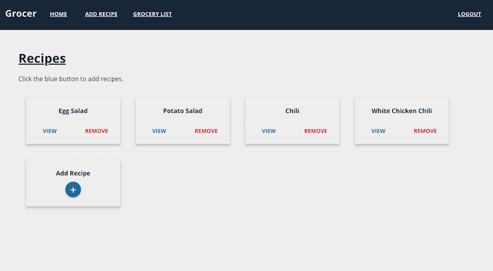
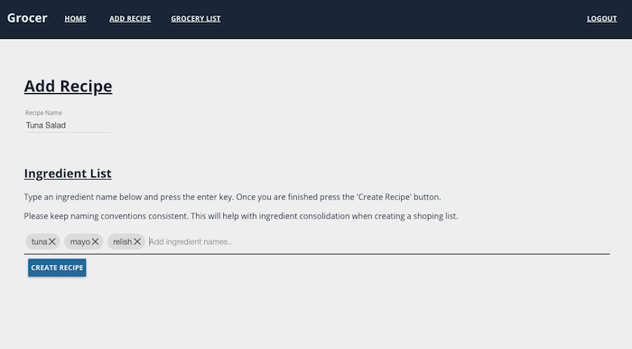
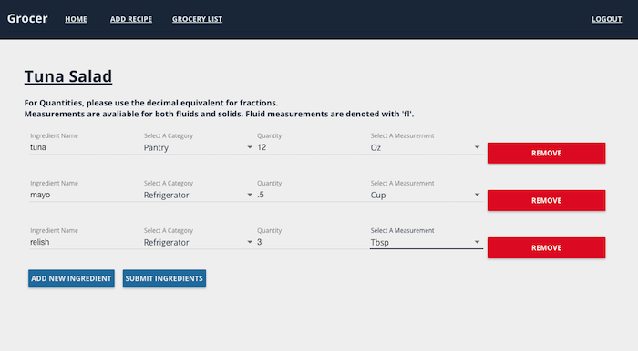
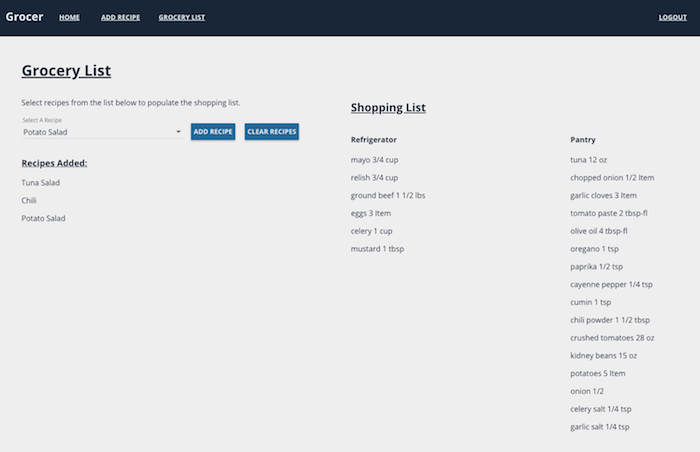

# Grocer

Grocer is a grocery shopping list application that is designed to help users prevent waste when buying groceries. Through the creation of recipe cards, users can generate grocery lists that include the required ingredients to make the selected recipes. Ingredient totals are aggregated by name and the total ingredients needed for a shopping run is given to the user.

## Built With

- HTML/CSS
- JavaScript
- MEAN Stack
    - MongoDB
    - Express.js
    - AngularJS
    - Node.js
- Quantities.js

## Getting Started

These instructions will get you a copy of the project up and running on your local machine for development and testing purposes. See deployment for notes on how to deploy the project on a live system.

### Prerequisites

Link to software that is required to install the app (e.g. node).

- [Node.js](https://nodejs.org/en/)
- [MongoDB](https://www.mongodb.com/)

## Screen Shot

### Completed Features

High level list of items completed.

- [x] Create recipes.
- [x] Add ingredients to recipes.
- [x] Update ingredients in recipes.
- [x] Delete recipes.
- [x] Add recipe ingredients to shopping list.
- [x] Consolidate like ingredients in shopping list.

### Next Steps

Features that you would like to add at some point in the future.

- [ ] Add a 'Pantry' feature that allows users to add ingredients they have at home.
- [ ] Check shopping lists against users pantry to remove any ingredients the user already has.

## Authors

* Philip Owen
